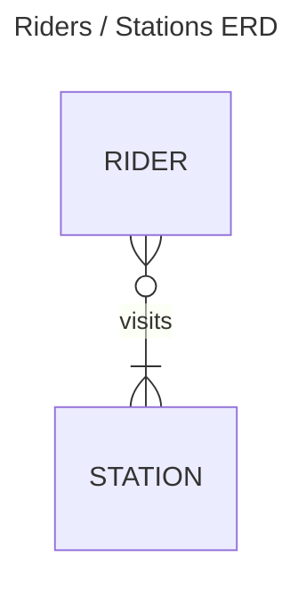
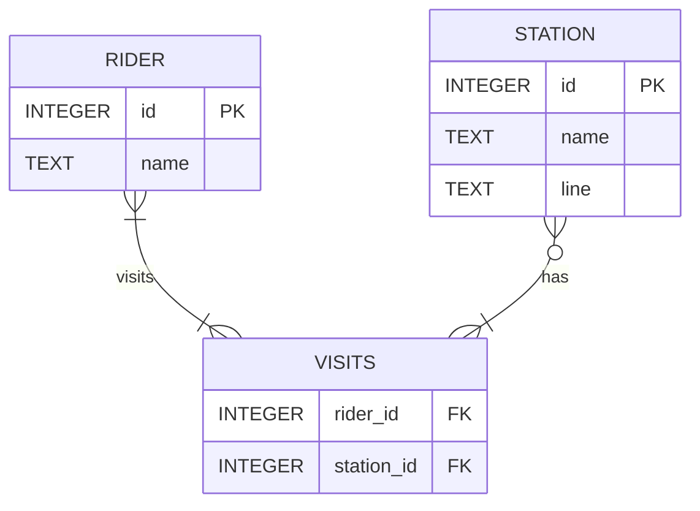

# Creating a Database Schema

Context: we are tasked to crate a database about the Boston subway rail system.

The first order of business is to identify the entities we need to represent:
The process of separating our data in this manner is called normalizing. When normalizing, we put each entity in its own
table—as we did with riders and subway stations. Any information about a specific entity, for example a rider’s address,
goes into the entity’s own table.

- rider
- station

Then we need to understand the relationship existing between those entities:
We now need to decide how our entities (riders and stations) are related. A rider will likely visit multiple stations,
and a subway station is likely to have more than one rider. Given this, it will be a many-to-many relationship.



Here, we see that:

- every **rider** must visit at least one **station** to be considered a rider.
- A **station**, though, could have no riders visiting it, because perhaps it is out of order temporarily.
  However, it is likely that a station has multiple riders visiting it, indicated by the crow’s foot in the ER diagram.

## `CREATE TABLE`

> [!NOTE]
> All the schema definitions for this section can be found in [schema0.sql](src/schema/schema0.sql)

```sqlite
-- create riders table
CREATE TABLE "riders"
(
  id,
  name
);
```

```sqlite
-- create a stations table
CREATE TABLE "stations"
(
  id,
  name,
  line
);
```

## Data types and Storage Classes

in SQLite, there are five storage classes:

- `NULL`: nothing or empty value
- `INTEGER`: number without a decimal points
- `REAL`: decimal or floating points number
- `TEXT`: character or strings
- `BLOB`: Binary Large Object, for storing objects in binary form (useful for images, audio. etc.)

A storage class can comprise several data types:
For example, these are the data types that fall under the umbrella of the integer storage class

| bite   | data type |
|--------|-----------|
| 0-bite | integer   |
| 1-bite | integer   |
| 2-bite | integer   |
| 3-bite | integer   |
| 4-bite | integer   |
| 5-bite | integer   |
| 6-bite | integer   |
| 7-bite | integer   |
| 8-bite | integer   |

SQLite takes care of storing the input value under the right data type. In other words, we as programmers only need to
choose a storage class and SQLite will do the rest!

## Type Affinities

columns can be made to store certain Storage Classes.
in SQLite, columns do not store a particular data type, but rather they have a Type Affinities, meaning that they
will try to convert some value to the value they have the affinity for.

SQLite columns have five type affinities:

- `TEXT`: character or strings
- `NUMERIC`: store either integer values or real
- `INTEGER`: whole number
- `REAL`: floating points
- `BLOB`: Binary Large Object

## Adding types to our tables

```sqlite
-- Deletes prior tables if they exist
DROP TABLE IF EXISTS "riders";
DROP TABLE IF EXISTS "stations";
DROP TABLE IF EXISTS "visits";


CREATE TABLE "riders"
(
  id   INTEGER,
  name TEXT
);

CREATE TABLE "stations"
(
  id   INTEGER,
  name TEXT, -- name of the station
  line TEXT  -- name of the line
);


CREATE TABLE "visits"
(
  rider_id   INTEGER, -- the relation to riders
  station_id INTEGER  -- the relation to stations
);

```

now our new ERD looks like this:



## Table Constraints

`PRIMARY KEY`
`FOREIGN KEY`

## Column Constraints

A colum constraint is a type of constraint that applies to a specified column in the table.
SQLite has four column constraints:

- `CHECK`: Allows checking for a condition, like all values in column must be greater than 0
- `DEFAULT`: uses a default value if none is supplied into the column
- `NOT NULL`: dictates that a null or an empty value cannot be inserted into the column
- `UNIQUE`: dictates that every value in this column must be unique
