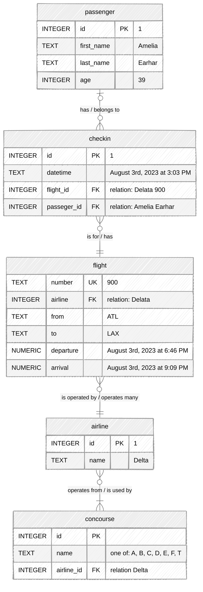

Your task at hand is to create a SQLite database for ATL from scratch, as by writing a set of CREATE TABLE statements in
a schema.sql file. The implementation details are up to you, though you should minimally ensure your database meets the
airport’s requirements and that it can represent the given sample data.

## Requirements

To understand ATL’s requirements for their database, you sat down to have a conversation with the Assistant General
Manager for IT Operations.

### Passengers

> When it comes to our passengers, we just need to have the essentials in line:
> - the first name,
> - last name,
> - and age.
>
> That’s all we need to know—nothing more.

### Check-Ins

> When passengers arrive at ATL, they’ll often “check in” to their flights.
> That’s them telling us they’re here and all set to board.
> We’d like to keep a tidy log of such moments.
> And what would we need to log, you ask?
> Well, here’s what we need:
>
> - The exact date and time at which our passenger checked in
> - The flight they are checking in for, of course. Can’t lose track of where they’re headed, now can we?

### Airlines

> ATL’s a hub for many domestic and international airlines: names like Delta, British Airways, Air France, Korean Air,
> and Turkish Airlines. The list goes on. So here’s what we track:
> - The name of the airline
> - The “concourse” or, shall I say, the section of our airport where the airline operates.
    We have 7 concourses: A, B, C, D, E, F, and T.

### Flights

> We serve as many as 1,000 flights daily.
> To ensure that our passengers are never left wondering, we need to give them all the critical details about their
> flight. Here’s what we’d like to store:
>
> - The flight number. For example, “900”. Just know that we sometimes re-use flight numbers.
> - The airline operating the flight. You can keep it simple and assume one flight is operated by one airline.
> - The code of the airport they’re departing from. For example, “ATL” or “BOS”.
> - The code of the airport they’re heading to
> - The expected departure date and time (to the minute, of course!)
> - The expected arrival date and time, to the very same accuracy

### Concourse

> Is the section of our airport where the airline operates.
> We have seven concourses: A, B, C, D, E, F, and T.

## Sample Data

Your database should be able to represent…

- A passenger, **Amelia Earhart**, who is 39 years old
- An airline, **Delta**, which operates out of concourses A, B, C, D, and T
- A flight, **Delta Flight 300**, which is expected to depart from ATL on August 3rd, 2023 at 6:46 PM and arrive at BOS
  on August 3rd, 2023 at 9:09 PM
- A check-in for Amelia Earhart, for Delta Flight 300, on August 3rd, 2023 at 3:03 PM

___

## Entity Relationship Diagram

