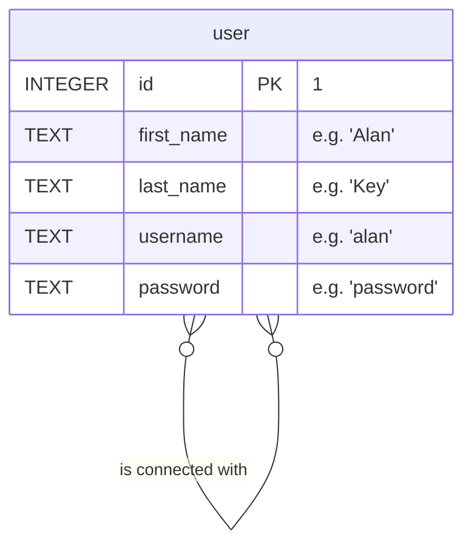

```mermaid
erDiagram
  user {
    INTEGER id PK "1"
    TEXT first_name "e.g. 'Alan'"
    TEXT last_name "e.g. 'Key'"
    TEXT username "e.g. 'alan'"
    TEXT password "e.g. 'password'"
  }

  user }o--o{ user: "is connected with"
```
