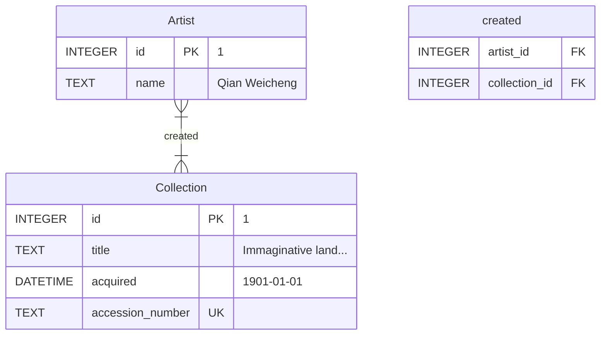

## Inserting data

```sqlite
SELECT *
FROM collections;
```

The SQL statement `INSERT INTO` is used to insert a row of data into a given table.

```sqlite
INSERT INTO collections
  ( id, title, accession_number, acquired )
VALUES
  ( 1, 'Profusion of flowers', '56.257', '1956-04-12' );
```

| id | title                | accession\_number | acquired   |
|:---|:---------------------|:------------------|:-----------|
| 1  | Profusion of flowers | 56.257            | 1956-04-12 |

ASIDE: running `INSERT INTO` command returns nothing.

```sqlite
INSERT INTO collections
  ( title, accession_number, acquired )
VALUES
  ( 'Farmers working at dawn', '11.6152', '1911-08-03' );
```

| id   | title                   | accession\_number | acquired   |
|:-----|:------------------------|:------------------|:-----------|
| 1    | Profusion of flowers    | 56.257            | 1956-04-12 |
| null | Farmers working at dawn | 11.6152           | 1911-08-03 |

## insert with table constraint

failing to insert due to `UNIQUE` constraint:

```sqlite
INSERT INTO collections
  ( title, accession_number, acquired )
VALUES
  ( 'Farmers working at dawn', '11.6152', '1911-08-03' );
```

> [SQLITE_CONSTRAINT_UNIQUE] A UNIQUE constraint failed (UNIQUE constraint failed:
> collections.accession_number)

failing to insert due to `NOT NULL` constraint

```sqlite
INSERT INTO collections
  ( title, accession_number, acquired )
VALUES
  ( NULL, NULL, '1900-01-10' );
```

> [SQLITE_CONSTRAINT_NOTNULL] A NOT NULL constraint failed (NOT NULL constraint failed: collections.title)

## insert multiple rows

we can insert more than a row at a time while writing into a database.

```sqlite
-- multirow insert template
INSERT INTO table
  ( column0, ... )
VALUES
  ( value0, ... ), VALUES
  ( value1, ... );
```

```sqlite
INSERT INTO collections
  ( title, accession_number, acquired )
VALUES
  ( 'Imaginative landscape', '56.496',  NULL         ),
  ( 'Peonies and butterfly', '06.1899', '1906-01-01' );
```

| id | title                   | accession\_number | acquired   |
|:---|:------------------------|:------------------|:-----------|
| 1  | Profusion of flowers    | 56.257            | 1956-04-12 |
| 2  | Farmers working at dawn | 11.6152           | 1911-08-03 |
| 3  | Imaginative landscape   | 56.496            | null       |
| 4  | Peonies and butterfly   | 06.1899           | 1906-01-01 |

### CSV

Our data could also be stored in a comma-separated values format, or CSV.

```csv
id,title,accession_number,acquired
1,Profusion of flowers,56.257,1956-04-12
2,Farmers working at dawn,11.6152,1911-08-03
3,Spring outing,14.76,1914-01-08
4,Imaginative landscape,56.496,
5,Peonies and butterfly,06.1899,1906-01-01

```

SQLite makes it possible to import CSV file directly in our database... to do this we need to start from scratch.

we have a CSV file called [mfa.csv](src/insert/import/import0/mfa.csv)

```shell
.import --csv --skip 1 src/insert/import/import0/mfa.csv collections
```

the issue with the csv that we were working with, was that it was hardcoding the rows id...

```csv
title,accession_number,acquired
Profusion of flowers,56.257,1956-04-12
Farmers working at dawn,11.6152,1911-08-03
Spring outing,14.76,1914-01-08
Imaginative landscape,56.496,
Peonies and butterfly,06.1899,1906-01-01

```

```sqlite
DELETE
FROM collections;
```

the edited CSV file called without ids  [mfa.csv](src/insert/import/import1/mfa.csv)

Now, we want to import this CSV file into a table.
However, the collections table (as per our schema) must have four columns in every row.
This new CSV file contains only three columns for every row. Hence, we cannot proceed to import in the same way we did
before.

```shell
sqlite3 mfa.db
> .import --csv src/insert/import/import1/mfa.csv temp
```

```sqlite
SELECT *
FROM temp;
```

```sqlite
-- Import into an existing table using a CSV without primary keys

INSERT INTO collections
  ( title, accession_number, acquired )
SELECT title, accession_number, acquired
FROM temp;

DROP TABLE temp;
```

## `DELETE`

to delete one item, we can use the `DELETE` command in conjunction with the `WHERE` condition in order to identify which
row/s to target for deletion.

```sql
DELETE
FROM table
WHERE condition;
```

```sqlite
SELECT *
FROM collections;
```

| id | title                   | accession\_number | acquired   |
|:---|:------------------------|:------------------|:-----------|
| 6  | Profusion of flowers    | 56.257            | 1956-04-12 |
| 7  | Farmers working at dawn | 11.6152           | 1911-08-03 |
| 8  | Spring outing           | 14.76             | 1914-01-08 |
| 9  | Imaginative landscape   | 56.496            |            |
| 10 | Peonies and butterfly   | 06.1899           | 1906-01-01 |

```sqlite
DELETE
FROM collections
WHERE title = 'Spring outing';
```

| id | title                   | accession\_number | acquired   |
|:---|:------------------------|:------------------|:-----------|
| 6  | Profusion of flowers    | 56.257            | 1956-04-12 |
| 7  | Farmers working at dawn | 11.6152           | 1911-08-03 |
| 9  | Imaginative landscape   | 56.496            |            |
| 10 | Peonies and butterfly   | 06.1899           | 1906-01-01 |

```sqlite
DELETE
FROM collections
WHERE acquired IS NULL;
```

| id | title                   | accession\_number | acquired   |
|:---|:------------------------|:------------------|:-----------|
| 6  | Profusion of flowers    | 56.257            | 1956-04-12 |
| 7  | Farmers working at dawn | 11.6152           | 1911-08-03 |
| 10 | Peonies and butterfly   | 06.1899           | 1906-01-01 |

```sqlite
DELETE
FROM collections
WHERE acquired < '1909-01-01';
```

| id | title                   | accession\_number | acquired   |
|:---|:------------------------|:------------------|:-----------|
| 6  | Profusion of flowers    | 56.257            | 1956-04-12 |
| 7  | Farmers working at dawn | 11.6152           | 1911-08-03 |

## Foreign Key Constraints

let's update our schema for the Museum of Fine Art (Boston),
by adding a new entity, the artists and their relationship with the collections.



```sqlite

-- seed the db

INSERT INTO collections
  ( title, accession_number, acquired )
VALUES
  ( 'Profusion of flowers',    '56.257',  '1956-04-12' ),
  ( 'Farmers working at dawn', '11.6152', '1911-08-03' ),
  ( 'Spring outing',           '14.76',   '1914-01-08' ),
  ( 'Imaginative landscape',   '56.496',  NULL         ),
  ( 'Peonies and butterfly',   '06.1899', '1906-01-01' );

INSERT INTO artists
  ( name )
VALUES
  ( 'Li Yin'              ),
  ( 'Qian Weicheng'       ),
  ( 'Unidentified artist' ),
  ( 'Zhou Chen'           );

INSERT INTO created
  ( artist_id, collection_id )
VALUES
  ( (
      SELECT id
      FROM artists
      WHERE name = 'Li Yin'
    ), (
         SELECT id
         FROM collections
         WHERE title = 'Imaginative landscape'
       ) ),
  ( (
      SELECT id
      FROM artists
      WHERE name = 'Qian Weicheng'
    ), (
         SELECT id
         FROM collections
         WHERE title = 'Profusion of flowers'
       ) ),
  ( (
      SELECT id
      FROM artists
      WHERE name = 'Unidentified artist'
    ), (
         SELECT id
         FROM collections
         WHERE title = 'Farmers working at dawn'
       ) ),
  ( (
      SELECT id
      FROM artists
      WHERE name = 'Zhou Chen'
    ), (
         SELECT id
         FROM collections
         WHERE title = 'Spring outing'
       ) );

```

Given this database, if we choose to delete the unidentified artist (with the ID 3), what would happen to the rows in
the table created with an artist_id of 3? Let’s try it out.

```sqlite
DELETE
FROM artists
WHERE name = 'Unidentified artist';
```

In another possibility, we can specify the action to be taken when an ID referenced by a foreign key is deleted. To do
this, we use the keyword `ON DELETE` followed by the action to be taken.

- `ON DELETE RESTRICT`:
  This restricts us from deleting IDs when the foreign key constraint is violated.
- `ON DELETE NO ACTION`:
  This allows the deletion of IDs that are referenced by a foreign key and nothing happens.
- `ON DELETE SET NULL`:
  This allows the deletion of IDs that are referenced by a foreign key and sets the foreign key references to NULL.
- `ON DELETE SET DEFAULT`:
  This does the same as the previous, but allows us to set a default value instead of `NULL`.
- `ON DELETE CASCADE`:
  This allows the deletion of IDs that are referenced by a foreign key and also proceeds to cascadingly delete the
  referencing foreign key rows. For example, if we used this to delete an artist ID, all the artist’s affiliations with
  the artwork would also be deleted from the created table.

## Updating data

```sql
-- update syntax template
UPDATE table
SET
  column0 = value0,
  where condition;
```

```sqlite
UPDATE created
SET
  artist_id = (
                SELECT a.id
                FROM artists a
                WHERE a.name = 'Li Yin'
              )
WHERE collection_id = (
                        SELECT c.id
                        FROM collections c
                        WHERE c.title = 'Farmers working at dawn'
                      );
```

## Triggers

```sqlite
DROP TABLE IF EXISTS transactions;
CREATE TABLE transactions (
  id     INTEGER PRIMARY KEY AUTOINCREMENT,
  title  TEXT NOT NULL,
  action TEXT NOT NULL CHECK ( action IN ('bought', 'sold') )
  );

```

```sql
CREATE TRIGGER trgger_name --   BEFORE DELETE
-- BEFORE UPDATE
-- BEFORE INSERT
-- AFTER INSERT
-- AFTER UPDATE
-- AFTER DELETE
-- INSTEAD OF DELETE
-- INSTEAD OF UPDATE
--   INSTEAD OF INSERT
  BEFORE DELETE
  ON "table"
BEGIN
  FOR EACH ROW
--   ...;
END;
```

```sqlite

CREATE TRIGGER sell
  BEFORE DELETE
  ON collections
  FOR EACH ROW
BEGIN
  INSERT INTO transactions
    ( title, action )
  VALUES
    ( old.title, 'sold' );
END;
```

```sqlite
DELETE
FROM collections
WHERE title = 'Farmers working at dawn';
```

```sqlite

CREATE TRIGGER buy
  AFTER INSERT
  ON collections
  FOR EACH ROW
BEGIN
  INSERT INTO transactions
    ( title, action )
  VALUES
    ( new.title, 'bought' );
END;
```

```sqlite
INSERT INTO collections
  ( title, accession_number, acquired )
VALUES
  ( 'Farmers working at dawn', '11.6152', '1911-08-03' );
```
