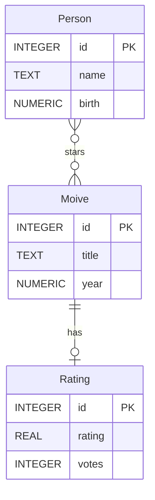
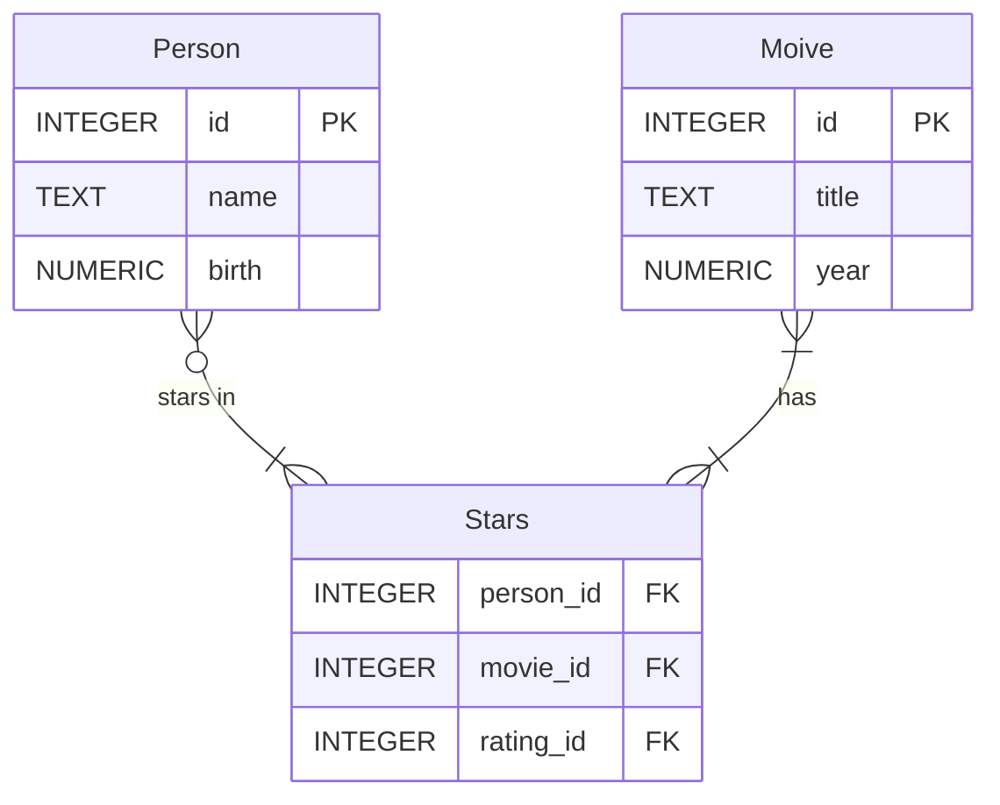

# Optimizing Databases

taken the IMDb database



one way to implement `many to many relationship` is to use a bridge/join table



in sqlite, to check how much time a specific query took, we could turn on the `.timer` flag.

```shell
> sqlite3 movies.db
> .timer on
> SELECT * FROM movies m WHERE m.title LIKE 'cars';
```

An unoptimized query for a particular vale in a column will force the db engine to do a full `scan` of all the rows;
in algorithmic terms this is a linear search on an unordered dataset with a time complexity of `O(n)` where `n` is the
total count of all the entries/rows for that specific table.

How can we optimize it?

## Index

A structure used to speed up the retrieval of rows from a table

```sql
-- index creation template syntax
CREATE INDEX name ON table (column0, ...)
```

## `EXPLAIN QUERY PLAN  SELECT ...`

```sqlite
EXPLAIN QUERY PLAN
SELECT *
FROM movies
WHERE title = 'Cars'
```

```shell
> QUERY PLAN
> `--SCAN movieS
> Run Time: real 0.000 user 0.000127 sys 0.000050
```

but with an index...

```sqlite
CREATE INDEX title_index ON movies (title);

EXPLAIN QUERY PLAN
SELECT *
FROM movies
WHERE title = 'Cars'
```

```shell
> QUERY PLAN
> `SEARCH movies USING INDEX title_index (title=?)
> 1 row retrieved starting from 1 in 35 ms (execution: 5 ms, fetching: 30 ms)
```

The process for understanding how to improve the time performance of a specific query stats with a `EXPLAIN QUERY PLAN`.
For example, given we are interested in finding all the movies where "Tom Hanks"
stared in, we would have to write a nested query as such...

```sqlite
SELECT title
FROM movies
WHERE id IN (
              SELECT movie_id
              FROM stars
              WHERE person_id = (
                                  SELECT id
                                  FROM people
                                  WHERE name = 'Tom Hanks'
                                )
            );
```

```shell
sqlite> Run Time: real 0.116 user 0.106817 sys 0.008662
```

```sqlite
EXPLAIN QUERY PLAN
SELECT title
FROM movies
WHERE id IN (
              SELECT movie_id
              FROM stars
              WHERE person_id = (
                                  SELECT id
                                  FROM people
                                  WHERE name = 'Tom Hanks'
                                )
            );
```

```shell
QUERY PLAN
|--SEARCH movies USING INTEGER PRIMARY KEY (rowid=?)
`--LIST SUBQUERY 2
   |--SCAN stars
   `--SCALAR SUBQUERY 1
      `--SCAN people
```

you read the return definition inside out:

1. scan people to find "Tom Hanks"' id
2. scan starts to find movie_id that have "Tom Hanks"' person_id
3. finally, SEARCH movies USING INTEGER PRIMARY KEY (rowid=?)

so it seems that the missing optimization should be on people's table and starts table

```sqlite
-- Create index on foreign key
CREATE INDEX IF NOT EXISTS person_index ON stars (person_id);

-- Create index to speed name look-ups
CREATE INDEX IF NOT EXISTS name_index ON people (name);

EXPLAIN QUERY PLAN
SELECT title
FROM movies
WHERE id IN (
              SELECT movie_id
              FROM stars
              WHERE person_id = (
                                  SELECT id
                                  FROM people
                                  WHERE name = 'Tom Hanks'
                                )
            );
```

```shell
sqlite> Run Time: real 0.002 user 0.000747 sys 0.001075
```

```shell
QUERY PLAN
|--SEARCH movies USING INTEGER PRIMARY KEY (rowid=?)
`--LIST SUBQUERY 2
   |--SEARCH stars USING INDEX person_index (person_id=?)
   `--SCALAR SUBQUERY 1
      `--SEARCH people USING COVERING INDEX name_index (name=?)

```

1. SEARCH people USING COVERING INDEX name_index (name = 'Tom Hanks')
2. SEARCH stars USING INDEX person_index (person_id = tom_hanks_person_id)
3. SEARCH movies USING INTEGER PRIMARY KEY (rowid=?)

`Covering Index`
An index in which queried data can be retrieved from the index itself

next optimization step could be to create a covering index for the `stars` table,
so that both `person_id` and `movie_id` are considered at the same time.

```sqlite
-- Make person_index a covering index for the above query
CREATE INDEX IF NOT EXISTS person_index ON stars (person_id, movie_id);

EXPLAIN QUERY PLAN
SELECT title
FROM movies
WHERE id IN (
              SELECT movie_id
              FROM stars
              WHERE person_id = (
                                  SELECT id
                                  FROM people
                                  WHERE name = 'Tom Hanks'
                                )
            );
```

```shell
|--SEARCH movies USING INTEGER PRIMARY KEY (rowid=?)
`--LIST SUBQUERY 2
   |--SEARCH stars USING COVERING INDEX person_index (person_id=?)
   `--SCALAR SUBQUERY 1
      `--SEARCH people USING COVERING INDEX name_index (name=?)
```

```shell
sqlite> Run Time: real 0.001 user 0.000437 sys 0.000425
```

the performance difference is big...

| time  | indexes                      | delta time               |
|-------|------------------------------|--------------------------|
| 0.116 | none                         | 0                        |
| 0.001 | `name_index`, `person_index` | - 2 orders of magnitudes |

wow!
> Q: but in software engineering nothing comes for free;
> a 2x performance time improvement should have some downside, right?
>
> A: Yes we have traded `time` complexity for `space` complexity

### Partial index

There are also ways to optimize indexes with an eye on space complexity:

> Partial index: An index that includes only a subset of rows from a table

```sql
CREATE INDEX name ON table (column0, ...) WHERE condition;
```

e.g.

```sqlite
-- Create a partial index to speed up searches involving the present year
CREATE INDEX recents ON movies (title) WHERE year = 2023;
```

```sqlite
-- Show query's usage of index
EXPLAIN QUERY PLAN
SELECT title
FROM movies
WHERE year = 2023;
```

```log
500 rows retrieved starting from 1 in 72 ms (execution: 10 ms, fetching: 62 ms)

SCAN movies USING COVERING INDEX recents
```

```sqlite
-- Show query's usage of index
EXPLAIN QUERY PLAN
SELECT title
FROM movies
WHERE year = 1998;
```

```log
500 rows retrieved starting from 1 in 50 ms (execution: 8 ms, fetching: 42 ms)

SCAN movies
```

## `VACUUM`

turns out that drop does not eliminate the database bits that need to be removed,
but rather it only marks them for deletion.
Then the `VACUUM` keyword command is necessary for these changes to be committed and alter the sored file.

```sqlite
VACUUM;
```

## Concurrency

## Transaction

> [!NOTE]
> a **`Transaction`** is an individual unit of work in a database

meaning a transaction happens all at once or not at all;
if one statement fails, then all the transactions fail too and no changes are applied.

a transaction has several properties all under the acronimum
of [A](#atomicity).[C](#consistency).[I](#isolation).[D](.#durability)

#### Atomicity

Can't brake a transaction down into smaller pieces;
e.g. Cant brake a transaction between Alice and Bob into a `Alice update` and a `Bob update`,
it is just update both accounts at the same time.

#### Consistency

a transaction cant violate some database constraints;
e.g., cant pay Bob from the Alice account if Alice doesn't have the money;
if this is the case, the transaction will revert,
undo and go back to a consistent state before the breakage of the constraint.

#### Isolation

if more than one person is trying to access the database, their query and transactions will not interfere with
each others

#### Durability

in case of a failure, all the data up to the failure point will be there.

#### Transaction syntax

```sql
BEGIN TRANSACTION;
-- ...
COMMIT;
```

[bank.db](.src/concurrency/bank.db)

```sqlite bank.db
CREATE TABLE IF NOT EXISTS accounts (
  id      INTEGER,
  name    TEXT    NOT NULL,
  balance INTEGER NOT NULL CHECK (balance >= 0),
  PRIMARY KEY (id)
  )
```

````sqlite bank.db
SELECT *
FROM accounts;
````

| id | name    | balance |
|:---|:--------|:--------|
| 1  | Alice   | 10      |
| 2  | Bob     | 20      |
| 3  | Charlie | 30      |

````sqlite bank.db
SELECT *
FROM accounts;
````

```sqlite
UPDATE accounts
SET
  balance = balance + 10
WHERE id = (
             SELECT id
             FROM accounts
             WHERE name = 'Bob'
           );
```

```sqlite
UPDATE accounts
SET
  balance = balance - 10
WHERE id = (
             SELECT id
             FROM accounts
             WHERE name = 'Alice'
           );
```

But since these two steps are performed as separate commands,
from the domain prospective of, we get in an in-between state that is wrong;

```sqlite
BEGIN TRANSACTION;


UPDATE accounts
SET
  balance = balance - 10
WHERE id = (
             SELECT id
             FROM accounts
             WHERE name = 'Alice'
           );

UPDATE accounts
SET
  balance = balance + 10
WHERE id = (
             SELECT id
             FROM accounts
             WHERE name = 'Bob'
           );
COMMIT;
```

| id | name    | balance |
|:---|:--------|:--------|
| 1  | Alice   | 0       |
| 2  | Bob     | 30      |
| 3  | Charlie | 30      |

If we now perform the same transaction again, we expect it to fail since alice can't pay bob as she has zero balances.

`ROLLBACK`

## Locks

- UNLOCKED
- SHARED
- EXCLUSIVE
