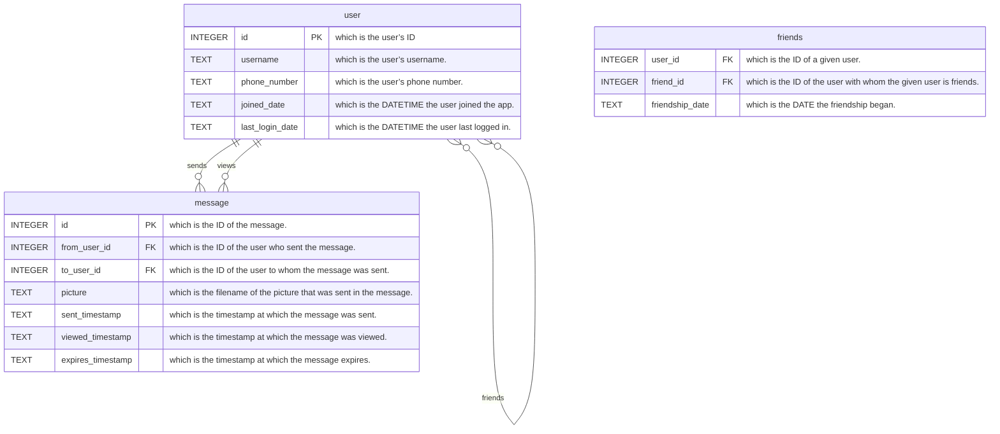

# Problem to Solve

After the printing press, the postal service, and the telegram came the messaging apps. Chances are you’ve used a
messaging app today—whether Facebook Messenger, iMessage, Instagram, Signal or Snapchat, among many others. Whereas
their early counterparts measured speed of communication in terms of weeks, days, or hours, messaging apps depend on a
kind of speed that’s on the order of milliseconds: a message delayed is now a connection missed.

In this problem, you’ll write SQL queries for a fictional app that allows users to send pictures which expire 30 seconds
after the recipient views them (an idea popularized by Snapchat!). The queries you’ll write will ultimately enable the
app to implement its core features. Yet, given the app has several thousand users depending on instant communication,
it’s especially important to write queries that are fast, not only correct. You’ll practice writing queries that take
advantage of indexes, all in the service of letting users stay in touch in a snap.

## Schema



## Specification

In each corresponding .sql file, write a SQL query to implement the features described below. Since speed is of the
essence, you’ll need to also ensure your query uses the specified index. The best way to ensure a query is using an
index to check the results of EXPLAIN QUERY PLAN.

If feeling unsure how to interpret the output of `EXPLAIN QUERY PLAN`, see the Advice section for some additional
explanation!

### `1.sql`

The app’s user engagement team needs to identify active users. Find all usernames of users who have logged in since
2024-01-01. Ensure your query uses the search_users_by_last_login index, which is defined as follows:

```sqlite
CREATE INDEX search_users_by_last_login ON users (last_login_date);
```

### `2.sql`

Users need to be prevented from re-opening a message that has expired. Find when the message with ID 151 expires.
You may use the message’s ID directly in your query.

Ensure your query uses the index automatically created on the primary key column of the messages table.

### `3.sql`

The app needs to rank a user’s “best friends,” similar to Snapchat’s “Friend Emojis” feature.
Find the user IDs of the top 3 users to whom creativewisdom377 sends messages most frequently.
Order the user IDs by the number of messages creativewisdom377 has sent to those users, most to least.

Ensure your query uses the search_messages_by_from_user_id index, which is defined as follows:

```sqlite
CREATE INDEX search_messages_by_from_user_id ON messages (from_user_id);
```

### `4.sql`

The app needs to send users a summary of their engagement. Find the username of the most popular user, defined as the
user who has had the most messages sent to them.

Ensure your query uses the search_messages_by_to_user_id index, which is defined as follows:

```sqlite
CREATE INDEX search_messages_by_to_user_id ON messages (to_user_id);
```

### `5.sql`

For any two users, the app needs to quickly show a list of the friends they have in common. Given two usernames,
lovelytrust487 and exceptionalinspiration482, find the user IDs of their mutual friends. A mutual friend is a user that
both lovelytrust487 and exceptionalinspiration482 count among their friends.

Ensure your query uses the index automatically created on primary key columns of the friends table. This index is called
sqlite_autoindex_friends_1.

___

> [!INFO]
> ## Use `EXPLAIN QUERY PLAN` to show a query's steps
>
> To check the results of EXPLAIN QUERY PLAN, you need simply prepend EXPLAIN QUERY PLAN to your query:
> ```sqlite
> EXPLAIN QUERY PLAN
> SELECT username
> FROM users
> WHERE id = 151;
> ```


> [!INFO]
> ## Interpret the results of `EXPLAIN QUERY PLAN`
>
> Recall from lecture that `EXPLAIN QUERY PLAN` displays the steps the SQLite database engine will take to execute a
> given
> SQL query. The output of `EXPLAIN QUERY PLAN` can indicate whether a query is utilizing an index.
>
> - If you see a step labeled as `USING INDEX`, it signifies that the query is leveraging an index in that step.
> - If you see a step labeled as `USING COVERING INDEX`, it indicates that the query is using a covering index in that
    step.
    > -- Recall that a covering index is a special type of index that includes all the columns needed for the query.
    This
    means the database can fulfill the query directly from the index without having to look up additional data in
    a table.
> - When you see a step labeled as `USING INTEGER PRIMARY KEY`, it implies that the query is utilizing the index on the
    primary key column, which is provided automatically by SQLite when the primary key is of the `INTEGER` type
    affinity.
>
> It is an efficient way to access rows directly if the query conditions involve a table’s primary key.
